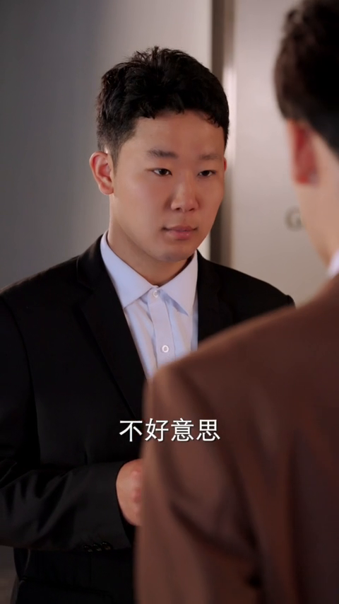
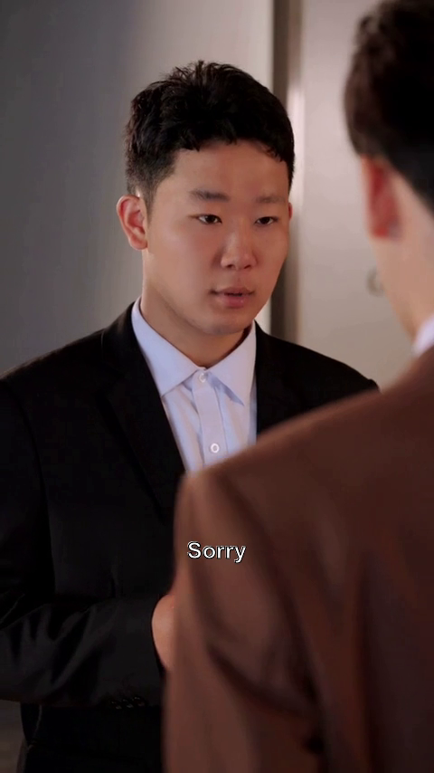
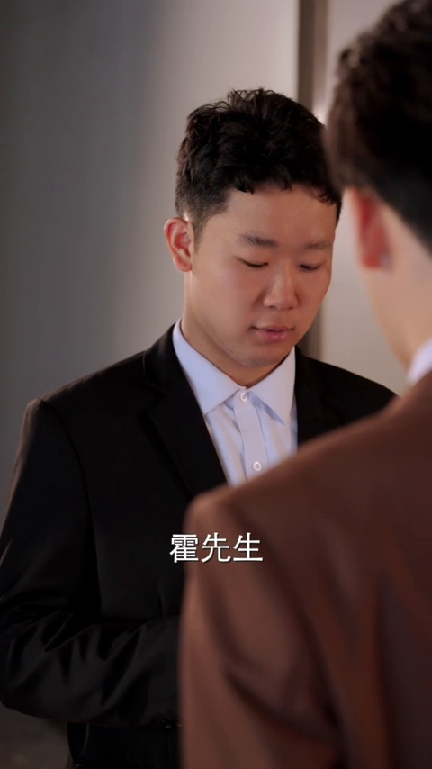
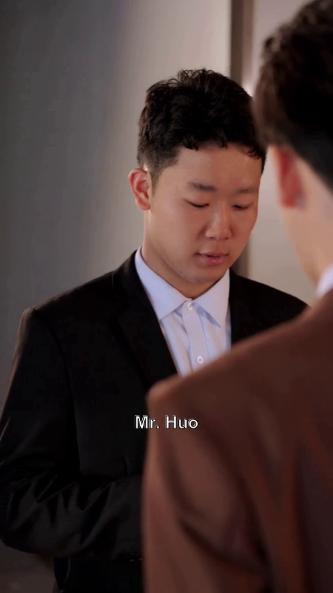

# SubErase-Translate-Embed

## 项目简介

SubErase-Translate-Embed 是一个开源工具，利用 OCR 技术识别短剧中的字幕，自动擦除原有字幕，并将翻译后的字幕嵌入到视频中。旨在提升多语言视频内容的可访问性，方便用户体验不同语言版本的短剧。

<table>
  <tr>
    <td>
      
    </td>
    <td>
      
    </td>
  </tr>
  <tr>
    <td>
      
    </td>
    <td>
      
    </td>
  </tr>
</table>

## 功能

- 识别视频中的字幕，paddleocr
- 擦除原字幕，sttn
- 翻译字幕到目标语言，chatgpt
- 将翻译后的字幕嵌入到视频中，moviepy

## 安装

1. 克隆项目：
    ```bash
    git clone https://github.com/chenwr727/SubErase-Translate-Embed.git
    ```

2. 安装依赖：
    ```bash
    pip install -r requirements.txt
    ```

3. 配置文件：
    ```bash
    cp config-template.yaml config.yaml
    ```

## 使用方法

```bash
python main.py --video input_video.mp4 --language English
```
其中 `input_video.mp4` 是你的视频文件名，`en` 是目标翻译语言代码。

## 参考

- [PaddleOCR](https://github.com/PaddlePaddle/PaddleOCR)
- [STTN](https://github.com/researchmm/STTN)
- [ChatGPT](https://chat.openai.com/)
- [MoviePy](https://zulko.github.io/moviepy/)
- [video-subtitle-remover](https://github.com/YaoFANGUK/video-subtitle-remover)
